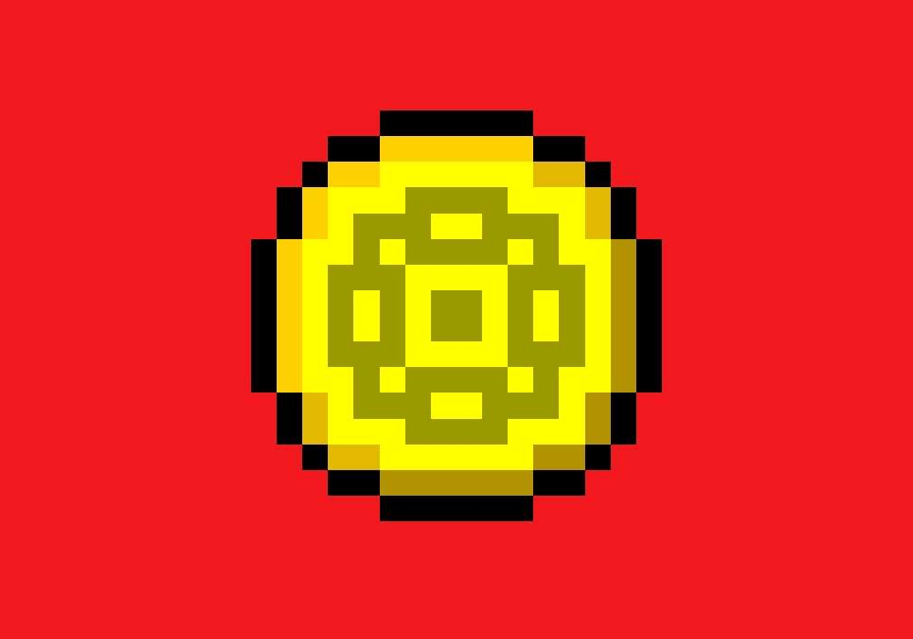

# _THE GOLDEN TOUCH_

- **Description :**

  The Golden Touch invites players into a captivating idle clicker experience. Developed in Unity for mobile devices, this game immerses players in a world where they possess the power to create gold at their fingertips. As they progress, players accumulate wealth and unlock upgrades to enhance their tapping prowess, ultimately aiming to amass unimaginable riches. With its intuitive gameplay mechanics, visually stunning graphics, and addictive progression system, The Golden Touch offers endless entertainment for fans of idle clicker games.

---

- **Controls :**

  - **Tap : `Press`**

---

- **Stack :**

  - **The Golden Touch : `0.5.1`**
  - **Unity : `2020.3.30f1`**

---

- **Credits :**

  - **Author : [FANTAS666X](https://github.com/FANTAS666IXI)**
  - **Visual Art : [FANTAS666X](https://github.com/FANTAS666IXI)**
